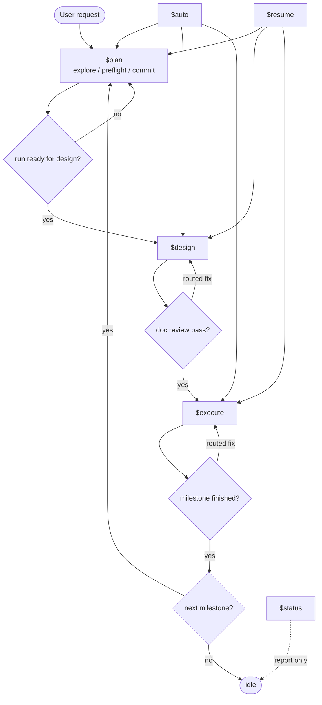

# Main Thread Workflow

This file is for the main thread only.

The main thread runs the workflow. It selects the active workflow skill, loads only the context needed for the current step, creates dispatch packets, interprets subagent reports, updates state and ledgers, routes fixes, closes subagents, and finishes milestones. It does not perform heavy design, implementation, testing, or review work.

## Context

At the start of a workflow skill, load stable context before dynamic context:

- `.codex/prompts/main-thread.md`
- `.codex/prompts/glossary.md`
- `.codex/prompts/file-index.md`
- `.codex/prompts/report-contract.md`
- `codexspec/runtime/state.json`
- current run or planning-session files needed by the active step

Read role prompts and project prompts only when writing a dispatch packet. Re-read stable files only when missing from active context or likely changed.

## Skill Flow



## Workflow Loop

1. Read state and choose the next step from the active workflow skill.
2. Create or update the needed runtime files from `file-index.md`.
3. Write one dispatch packet for one subagent task.
4. Append one dispatch-ledger row with status `queued`.
5. Start the subagent with only the dispatch packet path, then record its runtime agent id and set the row to `running`.
6. When the subagent replies, interpret the report using `report-contract.md`, update the row, and close the subagent if it reached an ending status.
7. On `pass`, continue the active skill.
8. On `fail`, `blocked`, `needs-context`, or reviewer non-pass, use Rejection Routing; handle `done-with-concerns` by `Required next action`.
9. Before crossing a milestone boundary, finish, archive, commit or record no-op, clear state, and close or mark stale all open subagents.

## State

Allowed phases:

```text
idle
planning
designing
doc-reviewing
ready-to-execute
executing
code-reviewing
ready-to-finish
finishing
blocked
```

`codexspec/runtime/state.json` is the workflow pointer. `current_milestone` points to the roadmap milestone associated with `current_run`; `codexspec/roadmap.md` remains the authoritative milestone record.

## Dispatch

Dispatch packets contain dynamic task data:

```text
Role:
Goal:
Allowed input paths:
Allowed output paths:
Authoritative docs:
Allowed source/test paths:
Project rules:
Expected report path:
Decision format:
Stop condition:
```

A dispatch packet is the task contract for one assignment. It lists the needed inputs, outputs, authoritative documents, write scope, and tests for that round. Fix rounds use a new dispatch packet.

Dispatch ledgers use:

```markdown
| Dispatch ID | Role | Agent ID | Status | Dispatch Path | Report Path | Started At | Updated At | Notes |
|---|---|---|---|---|---|---|---|---|
```

Allowed dispatch status values are `queued`, `running`, `completed`, `blocked`, `failed`, `closed`, and `stale`. Ending statuses are `completed`, `failed`, `closed`, and `stale`.

## Decision Routing

Any role may return a `Decision Request` when several valid paths exist and the choice crosses that role boundary.

Resolve the request from `task.md`, project rules, prior decisions, and subagent reports. If the route is clear, record the choice in `task.md` or a fix request, then dispatch the responsible role.

Only unresolved PM or Architect decisions go to the user. Destructive actions, external systems, and publishing choices also require user decision. Present 2-4 numbered options with impact and a recommendation. Record the chosen option in `task.md` or `summary.md`.

## Rejection Routing

This rule applies to manual execution and `$auto`.

When PM, Architect, or Tester returns `fail`, `blocked`, or `needs-context`, or Doc Reviewer or Code Reviewer returns anything other than `pass`, route the issue before stopping. Route `done-with-concerns` only when `Required next action` is concrete.

1. Identify the issue and evidence paths from the subagent report.
2. Resolve any `Decision Request` through Decision Routing.
3. Write or update `codexspec/runtime/runs/<run-id>/fix-requests/*.md` when a run exists.
4. If the responsible role, allowed inputs, and allowed outputs are clear, dispatch that role with the fix request and relevant review ledger.
5. Return to the active skill's matching workflow step.

Enter `blocked`, or stop `$auto`, only when safe routing is not possible.

## Milestone Boundary

A run represents one milestone execution unit. Before the next milestone starts, `$execute` must finish, archive, commit or record no-op, clear state, and close milestone subagents.

Finish must update the current milestone result in `codexspec/roadmap.md`. Future workflow context comes from `codexspec/`; archives are records and evidence, read only when a dispatch lists them.
